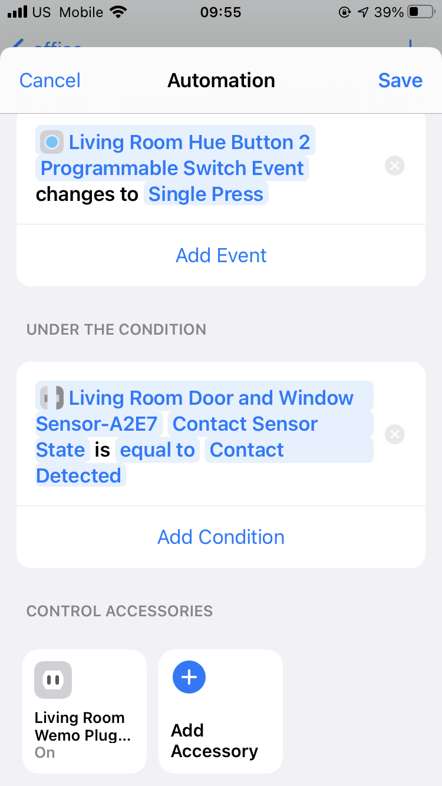

# Vulnerability and Attack Description

We find a design flaw of the [HomeKit Accessory Protocol (HAP)](https://developer.apple.com/homekit/specification/) for IP accessories. It can be exploited by local area network attackers to stealthily delay HomeKit accessory event messages towards the HomeKit hub for up to 40 minutes. We have documented the discovered vulnerability and our exploitation method in a research paper to be submitted to *Computer and Communications Security (CCS)* 2021 soon, and we write this report for doing an ethical and responsible disclosure.

**Vulnerability Description.**For network communication, message delays that are caused by packet transmission are inevitable. Normally, such delays are sub-seconds and would not cause issues. However, we find that in the HomeKit system, attackers can maliciously increase this delay for dozens of minutes.  Our key observation is that the timeout detection implementation in the TCP layer is decoupled from the data protection in the HomeKit Data Stream (HDS) protocol. Moreover, HomeKit Accessory Protocol does not have any acknowledgment and timestamp checking mechanism for event messages (Section 6.8.2 in HAP specification). By exploiting these design vulnerabilities, attackers can intentionally delay event messages sent from accessories to the hub for a long time. As a result, the HomeKit hub that receives an accessory event, which actually was raised dozens of minutes ago, incorrectly assumes the corresponding IoT device state update is fresh and uses it as the context to execute automation. In comparison, most other IP-based IoT protocols, such as MQTT and RESTful, require the automation hub/server to acknowledge the receiving of event messages and periodically exchange keep-alive messages with devices, which greatly restrict the length of time the attacker can delayed.  

**Who can launch such attacks?** To launch this attack, attackers need to hijack the TCP connection between the HomeKit hub and accessory. This can be easily achieved via the old and mature arp spoofing attack (surprisingly, this old attack is still effective against the newest Apple HomeKit hub devices, including iPad Pro and Homepod), which only requires the attacker has access to the same LAN as the HomeKit accessory and hub. Available scenarios for launching this attack is very common:

1. When HomeKit system is used in shared WiFi networks (e.g., Customers in a hotel, students in a university, and employees in a company connect their HomeKit system to the public WiFi network for smart automation applications), there could be thousands of smart devices connected to the same LAN, which can be fooled by the reported attacks.
2. For home deployments, the victim's home WiFi password could be leaked by malicious mobile apps (e.g., [some WiFi finder apps](https://securityboulevard.com/2019/04/popular-wifi-finder-app-leaks-2-million-passwords/)) or when the victim inadvertently shares the password to friends or neighbors. With the leaked password, attackers can join and access the victim's home LAN using their own devices.
3. For remote attackers, they can utilize compromised devices or malicious web scripts to access the victim's home LAN (e.g., *[Web-based Attacks to Discover and Control Local IoT Devices](https://www.esat.kuleuven.be/cosic/publications/article-3079.pdf)*).

**Possible exploitations.** Once the connection between the hub and the accessory is redirected to flow through the attacker-controlled device/process, the attackers can leverage the delay as an attacking primitive to launch two types of attacks.

1. **State-Update Delay Attack.** A homeowner should be notified of a critical state update as soon as possible (e.g., through a pop-up banner on the iPhone). However, an attacker can apply the delay primitive to network packets corresponding to an event message that reports an IoT state update. Despite the simplicity of the attack, it can cause severe consequences if a state update from some IoT devices is delayed for minutes or even hours. Such critical IoT devices include a water sensor that detects room flooding, a smoke detector that reports fires, a contact sensor that detects home invasion, and so forth. In these situations, every second matter.
2. **Erroneous Execution Attack.** Given a conditional automation f(e.g., automation set with [Home+ 5](https://apps.apple.com/us/app/home-5/id995994352)), an attacker may leverage the attack primitives to craft more sophisticated attacks: triggering spurious device actions or disabling expected device actions. This is conducted by delaying the events of either the trigger device or the condition device of an automation, which results in a condition device's state that is inconsistent with that of the real world at the time the automation is triggered. For example, for an automation that locks the smart lock when the user leaves home with the front door closed, the door locking action could be maliciously disabled by delaying the front door closed event until after the happening of user leaving home. 

**Impact of exploitations**. Compared to conventional jamming and Denial of Service (DoS) attacks (e.g., discarding packets), this attack is threatening for two reasons: 

1. The attackers can keep stealthy during the attack by causing no device offline alerts. During the delay, attackers can fool both the hub and the accessory to believe that the connection between them is still healthy by automatically acknowledging TCP segments. In contrast, jamming and DoS attacks inevitably break the session and trigger accessory offline alerts.
2. The delayed message is still valid to be accepted by the HomeKit hub and triggers automations' execution after the end of the delay period.  From the perspective of attackers, they can pick the exact time to release the delayed events for desired effects. While jamming and DoS attackers can only wait for the event to be retransmitted because the delayed event messages are discarded at the time of session breaking.  

**In summary**, the lack of event message acknowledgment (Section 6.8.2 in HAP specification), accessory keepalive mechanism (Section 6.8.2 in HAP specification), and event timestamp checking bring attackers a lot of conveniences to delay the event for a long time until the hub proactively polls the device's state, which ranges from 2 minutes to more than 40 minutes in our experiment. This delay can be further exploited to cause automations' erroneous execution. We follow this approach to build a prototype attacking tool, whose principle is illustrated in the graph below. 


The attacking device runs a TCP layer proxy that is transparent to the application layer (the HDS protocol). **AR**, **AW**, **HW**, **HR** stand for Accessory Read, Accessory Write, Hub Write, Hub Read, which are four threads of the proxy to handle socket connections with both the HomeKit accessory and HomeKit Hub. When we suspend the hub write thread, the event messages that are cached in the accessory queue will be delayed until the thread resumes working.

The procedure of event message delay attack could be described as the following 5 steps:

1. We hijack the connection between the target accessory device and the HomeKit hub via arp spoofing. More specifically, we periodically send fake arp response messages from an attacking computer to the hub and the accessory claiming the other end's IP address is associated with the attacking computer's MAC address. In this way, whatever the accessory and the hub want to send to each other will be sent to our attacking computer first.
2. We add iptables rules on the attacking computer, which redirect all packets between the accessory and the hub to a local port to be accessed by a user-space program.
3. On the attacking computer, we run a program that listens to the redirection port for any TCP connecting request. When the accessory launches a TCP connection to the HomeKit hub (the original connection should have already been interrupted at step 1, but the HomeKit hub will try to reconnect before raising accessory offline alert), it will be accepted by our program. After accepting the connection, our program retrieves the request's original destination IP address (i.e., the HomeKit hub) and launches a new connection to it. In this way, the original direction TCP connection between the accessory and the hub is broken into two independent connections. The TCP/IP stack on the attacking computer can automatically maintain both connections. 
4. On the attacking computer, we establish two queues to accommodate TCP segments' payloads received from two TCP connections respectively. At the same time, there are another two threads that running continuously to fetch segment payloads from queues and send them to their original destination. Until this step, we build a transparent proxy on the attacking computer that forwards messages between the accessory and the hub.
5. In our program, we start another thread that checks segments' lengths (since the content has been encrypted) before putting them into the queue.  Since certain types of events usually have a fixed length, the program can accurately localize the segment that contains the message that we are interested in. Whenever it sees the target segment, it suspends the sending threads for a configurable time, which intentionally adds the delay. After the end of the delay period, the suspend sending thread resumes working to send out all segments that are cached in the queue. 

In rest of this report, we will describe the detailed procedures to reproduce the event delay and erroneous execution attack. 

# Reproducing Steps

Here we describe the procedures to reproduce the **State-Update Delay Attack** with our prototype attacking tool. 

[Devices used for reproducing the State-Update Delay Attack](https://www.notion.so/de5d4c4178fe4cacaeb3dbabcd5f23f7)

We set up a typical HomeKit deployment with a HomeKit hub, Philips Hue accessories, which are all connected to a home WiFi router. The Hue dimmer switch from Philips (using Zigbee communication) connected to the Hue bridge hub first and then integrated into HomeKit. All accessories are connected to the same apple account in the same home environment. 

### Accessory-to-hub TCP Session Hijacking

For an IP  accessory that has already been paired to HomeKit through a hub, we can use a python script to send forged arp responses to them. More specifically, for the accessory, we claim the hub's IP address is at our Laptop's MAC address. For the hub, we claim the laptop's MAC address is associated with the accessories' IP address. In this way, traffic between them will be redirected to our Laptop. Then, we follow the doc of [mitmproxy](https://docs.mitmproxy.org/stable/howto-transparent/)  to further forward the redirected packets to a local port using these steps

Enable IP forwarding

```bash
sysctl -w net.ipv4.ip_forward=1
sysctl -w net.ipv6.conf.all.forwarding=1
```

Disable ICMP redirects

```bash
sysctl -w net.ipv4.conf.all.send_redirects=0
```

Insert iptables rules

```bash
iptables -t nat -A PREROUTING -p tcp --src $accessoryIp -m multiport --dports 1:65535 --dst $hubIP  -j REDIRECT --to-port $listenPort
iptables -t nat -A PREROUTING -p tcp --src $hubIP -m multiport --dports 1:65535 --dst $accessoryIp  -j REDIRECT --to-port $listenPort 
```

We automate the arp spoofing and packet redirection with a python script in `<project_root>/spoof/spoof.py`.  To use it, you need first go to the folder and install the required python packages specified in the `requirement.txt`. After that, edit the file of `delay.conf` by replacing the interface name with yours (i.e., the interface name printed by the`ifconfig`command) and hub/device IP address in your testbed.

```scheme
[common]
interface = eth0   #attacker network interface
hub = 192.168.1.136 #homekit hub address
device = 192.168.1.122 # target accessory address
port = 10000    #redirection port
```

 Then, run the script with sudo privilege and leave it running.

```bash
$ sudo -E python3 spoof.py
```

The script will prompt the sending of each arp response like this

```jsx
[+] Sent to 192.168.1.198 : 192.168.1.151 is-at 28:16:a8:4e:f3:49
[+] Sent to 192.168.1.151 : 192.168.1.198 is-at 28:16:a8:4e:f3:49
[+] Sent to 192.168.1.198 : 192.168.1.151 is-at 28:16:a8:4e:f3:49
[+] Sent to 192.168.1.151 : 192.168.1.198 is-at 28:16:a8:4e:f3:49
[+] Sent to 192.168.1.198 : 192.168.1.151 is-at 28:16:a8:4e:f3:49
[+] Sent to 192.168.1.151 : 192.168.1.198 is-at 28:16:a8:4e:f3:49
[+] Sent to 192.168.1.198 : 192.168.1.151 is-at 28:16:a8:4e:f3:49
[+] Sent to 192.168.1.151 : 192.168.1.198 is-at 28:16:a8:4e:f3:49
[+] Sent to 192.168.1.198 : 192.168.1.151 is-at 28:16:a8:4e:f3:49
[+] Sent to 192.168.1.151 : 192.168.1.198 is-at 28:16:a8:4e:f3:49
```

After the redirection of packets, we run our proxy program that listens to the redirection port. On receiving any TCP connection requests, it accepts them and retrieves the original destination IP address. Then, it launches a new connection to the original destination IP address (i.e., the HomeKit hub). As a result, an originally direct TCP session between the accessory and the hub is broken into two independent ones. For any accessory-to-hub session, we spawn 4 threads to handle the write and read of each TCP connection. Messages received from one side are put into a queue, which is popped and sent out by the writing thread of the other side. By checking the content in the queue, we can inspect every received message.

The proxy program is located in `<project_root>/proxy/passthrough.py`. You can run it by specifying the redirection port. By default the port is 10000. Please make sure the port is not occupied by other program and matches the configuration in `<project_root>/spoof/delay.conf`.

```scheme
.$ python3 proxy.py -p 10000 # -p is used to specify the redirection port, need to match the set value in `delay.conf`
```

Then, the program will automatically prompt the length and time of received packets.

```jsx
ceron@ceron-surface:~/Desktop/homekit/proxy$ python3 passthrough.py 
03/25/2021 05:47:46 PM | start listening at port 10000
03/25/2021 05:54:31 PM | 180 bytes to ('192.168.1.151', 8080)
03/25/2021 05:54:31 PM | new session with ('192.168.1.151', 8080) is established
03/25/2021 05:54:31 PM | 80 bytes to ('192.168.1.198', 49167)
03/25/2021 05:54:31 PM | 140 bytes to ('192.168.1.198', 49167)
03/25/2021 05:54:31 PM | 269 bytes to ('192.168.1.151', 8080)
03/25/2021 05:54:31 PM | 78 bytes to ('192.168.1.198', 49167)
03/25/2021 05:54:31 PM | 3 bytes to ('192.168.1.198', 49167)
```

### **State-Update Delay Attack.**

The same type of events of a specific accessory can be easily recognized by its length. For example, clicking the Philips Hue dimmer causes event messages of 187 bytes from the Philips Hue bridge to the HomeKit hub, and active motion event messages have a fixed length of bytes. We inspect every packet that is received from the accessory. If it has the matching length, we let the thread that is writing to the hub sleep for a period. In this way, the target event is sent out after the sleeping period, which means a delay of event arrival. Since we maintain separate TCP connections with the hub and the accessory, all received TCP segments will be acknowledged automatically to prevent the TCP timeout and none of the order of TCP segments order will be broken. As a result, the TCP connection is maintained and would not break during the delay of events. 

According to our experiment, accessory events can be delayed for arbitrarily long time until the hub sending requests to the accessory, which requires the accessory to respond in 10 seconds. In our experiment, the Philips Hue Dimmer switch event is successfully delayed for longer than 10 minutes. To be noticed, the delayed event messages are still accepted by the hub to trigger the execution of automation rules after the end of the delay period. 

To reproduce this delay, we need to add a line in the `<project_root>/proxy/flag.txt` while keeping the proxy running. The line of text controls the length of the event to be delayed and the period of delay. For example

```scheme
186,187 120 
# this configuration means start a delay of 120 seconds for the next 
# packet that has a payload length between 186 and 187 bytes. 
```

means starting delay period of 120 seconds when receiving an event with the length falling in the range of $[186,187]$ bytes. The from the prompt, you should be able to see the indication of delay start and end. 

```jsx
03/25/2021 05:43:14 PM | 235 bytes to ('192.168.1.151', 8080)
03/25/2021 05:43:14 PM | 45 bytes to ('192.168.1.198', 49165)
03/25/2021 05:43:19 PM | 187 bytes to ('192.168.1.198', 49165)
03/25/2021 05:43:19 PM | ---------------delay starts for 120 seconds---------------
03/25/2021 05:45:19 PM | ---------------delay ends for 120 seconds---------------
03/25/2021 05:45:20 PM | 235 bytes to ('192.168.1.151', 8080)
03/25/2021 05:45:20 PM | 45 bytes to ('192.168.1.198', 49165)
03/25/2021 05:45:26 PM | 187 bytes to ('192.168.1.198', 49165)
03/25/2021 05:45:27 PM | 235 bytes to ('192.168.1.151', 8080)
```

During the experiment of delay, please make sure the **Home** app on iPhone or iPad is not opened. Otherwise, the HomeKit hub may proactively poll the accessories' states, which causes disconnection of the delayed session and invalidate the delayed message.

### **Erroneous Execution Attack.**

We further verify the feasibility of the erroneous execution attack. We include two more devices to work with the Hue dimmer switch to form a conditional automation rule. In the rule, the Aqara contact sensor and the WeMo smart plug act as the condition and the action device, respectively.

[Additional Devices used for reproducing the Erroneous Execution Attack](https://www.notion.so/6055327b640b410cb38fb07d75ad16dd)

We achieve this by using a third-party app **[Home+5](https://apps.apple.com/us/app/home-5/id995994352)** from the iOS app store. It utilizes the hidden HomeKit API to enable setting up automations that contain conditions. We implement automation that turns on the WeMo switch when the Hue Dimmer Switch button is clicked (trigger), while the Aqara contact sensor has contact (condition). The configuration of the automation is shown in the figure below.



This conditional automation is configured using Home+ 5

Normally, if we click the button while the contact has no contact, the switch would not have any action. However, if we delay the event of the button click (187 bytes message), and close the contact sensor during the delay, the condition will be met after the end of the delay and falsely trigger the execution of the automation. This means there is no check of the timestamp of event messages. Even though the button click message actually happens earlier than the contact sensor message, it takes effect in the HomeKit hub by the time it is received. In our experiment, we successfully delay the event of the dimmer switch button for more than 1336 seconds (more than 20 minutes).

Similarly, if the contact sensor turns to "no contact" before the button getting clicked, the automation is supposed not to execute to turn on the WeMo smart plug. However, in our experiment, during the time that we delay the event of the Aqara contact sensor for 2483 (more than 40 seconds), dimmer switch button click events are still effective to trigger the automation's  action to turn on the WeMo smart plug.